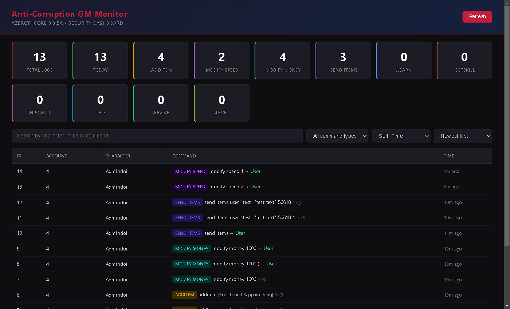

# Anti-Corruption GM Monitor

**Real-time Game Master command auditing and web dashboard for AzerothCore 3.3.5a (Wrath of the Lich King).**

Monitors GM rank 2 (`SEC_GAMEMASTER`) commands in-game, logs them to the `auth` database, notifies administrators in real-time, and provides a searchable web dashboard with item name resolution.



> **Demonstrative dashboard** — The included `server.js` serves an unprotected dashboard out of the box for local testing. **In production, you MUST add authentication.** Read the [Authentication Integration](#authentication-integration) section below. You can integrate this behind any existing login system — the API endpoints are standard REST and the frontend is vanilla HTML/JS/CSS with zero framework dependencies.

---

## Features

- **10 monitored commands**: `additem`, `modify speed`, `modify money`, `send items`, `learn`, `setskill`, `npc add`, `tele`, `revive`, `level`
- **Smart filtering**: `modify speed` only logged when used on OTHER players (self-use ignored)
- **Target tracking**: captures which player received the item/money/speed change
- **Real-time admin alerts**: GM rank 3+ receive color-coded in-game messages
- **Web dashboard**: dark WoW-themed UI with search, filters, pagination, stats
- **Item name resolution**: shows `[Frostbrood Sapphire Ring]` instead of just item ID
- **Case-insensitive**: catches `.additem`, `.ADDiTEM`, `.AddItem` equally
- **SQL injection safe**: prepared statements + character escaping
- **Auto-cleanup**: MySQL event deletes logs older than 30 days
- **Security**: rate limiting, CORS, ORDER BY whitelist, `.env` excluded from Git

---

## Requirements

| Component | Minimum |
|---|---|
| AzerothCore | 3.3.5a with `mod-ale` (AzerothCore Lua Engine) |
| MySQL / MariaDB | 5.7+ |
| Node.js | 16+ |
| npm | 8+ |

---

## Quick Start

### 1. Database setup

```bash
mysql -u root -p < sql/auth_setup.sql
```

This creates `custom_gm_action_logs` table in your `auth` database and a daily cleanup event.

### 2. Lua script

Copy `lua/gm_monitor.lua` to your server's `lua_scripts/` folder:

```bash
cp lua/gm_monitor.lua /path/to/azerothcore/lua_scripts/
```

Reload Eluna from the server console:

```
.reload eluna
```

### 3. Dashboard

```bash
cd dashboard
copy .env.example .env    # Then edit .env with your DB credentials
npm install
npm start
```

Open **http://localhost:3000** — the dashboard is ready.

---

## Installation — Full Guide

### Step 1: Apply the SQL

Run `sql/auth_setup.sql` against your AzerothCore `auth` database (typically `acore_auth`):

```sql
SOURCE /path/to/gm-monitor/sql/auth_setup.sql;
```

This creates:
- **`custom_gm_action_logs`** — stores every intercepted command with account ID, character name, command text, and timestamp
- **`cleanup_old_gm_logs`** — MySQL event that runs daily and deletes records older than 30 days

Verify:
```sql
SHOW TABLES LIKE 'custom_gm_action_logs';
SHOW EVENTS LIKE 'cleanup_old_gm_logs';
```

### Step 2: Install the Lua script

1. Copy `lua/gm_monitor.lua` to your AzerothCore server's `lua_scripts/` directory
2. Reload Eluna from the **server console** (not in-game):

```
.reload eluna
```

3. Verify: log in as GM rank 2, type `.additem 12345`, then check:
```sql
SELECT * FROM auth.custom_gm_action_logs ORDER BY id DESC LIMIT 1;
```

If nothing appears, check the server console for any Eluna errors.

### Step 3: Configure and start the dashboard

```bash
cd dashboard
copy .env.example .env
```

Edit `.env` with your actual credentials:

```env
DB_HOST=127.0.0.1
DB_USER=acore
DB_PASSWORD=your_actual_password
DB_NAME=acore_auth
WORLD_DB_NAME=acore_world
PORT=3000
PAGE_SIZE=25
```

Install dependencies and start:

```bash
npm install
npm start
```

The dashboard runs at `http://localhost:3000`.

### Step 4: Production deployment

For production, use **pm2** to keep the process alive:

```bash
npm install -g pm2
pm2 start server.js --name gm-monitor
pm2 save
pm2 startup
```

To run behind **nginx** with SSL, use a reverse proxy:

```nginx
server {
    listen 443 ssl;
    server_name monitor.your-domain.com;

    ssl_certificate     /path/to/cert.pem;
    ssl_certificate_key /path/to/key.pem;

    location / {
        proxy_pass http://127.0.0.1:3000;
        proxy_set_header Host $host;
        proxy_set_header X-Real-IP $remote_addr;
    }
}
```

---

## Authentication Integration

> **The default `server.js` is unprotected** — intended for local development only.
> Before exposing the dashboard to the internet or your staff, add authentication.

This project includes a ready-to-use authentication module (`auth.js`) that validates credentials directly against your AzerothCore `auth` database. It uses the same username and password that players and GMs use to log into the game. **Only accounts with GM level 3 (Administrator) or higher are granted access.**

### How AzerothCore stores passwords (WotLK 3.3.5a)

```
sha_pass_hash = SHA1(UPPER(username) + ":" + UPPER(password))
```

This is computed server-side and stored as an uppercase hex string in the `account` table of your `auth` database. The GM rank is stored separately in the `account_access` table (`gmlevel` column).

| GM Level | Enum | Has dashboard access? |
|---|---|---|
| 0 | `SEC_PLAYER` | No |
| 1 | `SEC_MODERATOR` | No |
| 2 | `SEC_GAMEMASTER` | No |
| 3 | `SEC_ADMINISTRATOR` | **Yes** |
| 4 | `SEC_CONSOLE` | **Yes** |

---

### Method 1: Use the included `auth.js` (recommended)

The file `dashboard/auth.js` provides a complete Passport.js authentication layer with zero external database configuration — it reuses your existing MySQL pool.

#### 1. Install the optional dependencies

```bash
cd dashboard
npm install express-session passport passport-local
```

#### 2. Wire it into `server.js`

Add these 3 lines **after** `const app = express();` and **before** your API routes:

```js
// Add after:  const app = express();
const { initAuth, requireAdmin } = require('./auth');
initAuth(app, pool, { realmId: 0 });
app.use(requireAdmin);

// Your existing routes follow...
// app.get('/api/logs', ...)
// app.get('/api/stats', ...)
```

That's it. The dashboard is now protected behind a login page. Users must enter a valid AzerothCore account that has GM level 3+.

#### 3. Configure environment variables

Add to your `.env`:

```env
SESSION_SECRET=some-random-string-32-chars
REALM_ID=0
```

- `SESSION_SECRET` — any random string used to sign session cookies
- `REALM_ID` — the realm ID from your `realmlist` table (usually `0` for single-realm). The auth module checks admin rights on this realm.

#### 4. Restart

```bash
npm start
```

Opening `http://localhost:3000` now redirects to `/login`. After logging in with an admin account, the dashboard loads.

#### Full example: `server-auth.js`

A complete version of `server.js` with auth wired in:

```js
require('dotenv').config();
const express = require('express');
const mysql   = require('mysql2/promise');
const path    = require('path');

// DB pools
const pool      = mysql.createPool({ /* auth DB config */ });
const worldPool = mysql.createPool({ /* world DB config */ });

const app = express();

// ---- AUTHENTICATION (3 lines) ----
const { initAuth, requireAdmin } = require('./auth');
initAuth(app, pool, { realmId: parseInt(process.env.REALM_ID, 10) || 0 });
app.use(requireAdmin);

// ---- Your API routes ----
app.get('/api/logs',  async (req, res) => { /* ... */ });
app.get('/api/stats', async (req, res) => { /* ... */ });
app.get('/api/items/batch', async (req, res) => { /* ... */ });

app.get('/', (req, res) => res.sendFile(path.join(__dirname, 'index.html')));
app.listen(process.env.PORT || 3000);
```

> Save this as `server-auth.js` and run with `node server-auth.js`.

#### Login page

The authentication module serves a built-in login page at `/login` styled to match the dashboard theme. No separate HTML file needed — it's generated inline by `auth.js`. You can customize it by editing the HTML string inside `auth.js`.

---

### Method 2: Integrate behind your existing website login

If you already have a website with its own authentication:

#### Option 2A — Reverse proxy with auth

Run the dashboard locally on `127.0.0.1:3000` (no port exposed) and proxy it through nginx behind your existing authentication:

```nginx
location /gm-monitor/ {
    # Your existing auth mechanism (e.g., auth_request)
    auth_request /internal/auth;

    proxy_pass http://127.0.0.1:3000/;
    proxy_set_header Host $host;
    proxy_set_header X-Real-IP $remote_addr;
    proxy_set_header X-Forwarded-For $proxy_add_x_forwarded_for;
}
```

The dashboard runs unmodified — your existing website handles all authentication.

#### Option 2B — Embed as an iframe

If your admin panel already requires login, embed the dashboard directly:

```html
<iframe
    src="http://127.0.0.1:3000"
    width="100%"
    height="850"
    frameborder="0"
    style="background:#0e0e10;border-radius:8px;">
</iframe>
```

Update CORS in `server.js` to allow your parent domain:

```js
res.header('Access-Control-Allow-Origin', 'https://your-admin-site.com');
```

#### Option 2C — Custom session check

If your website sets a session cookie that the dashboard can read, add a simple middleware to `server.js`:

```js
app.use((req, res, next) => {
    // Your website sets a cookie like 'admin_session=xxx'
    const sessionToken = req.cookies.admin_session;

    // Verify it against your own session store
    if (!isValidSession(sessionToken)) {
        return res.redirect('https://your-site.com/login');
    }
    next();
});
```

---

### Method 3: HTTP Basic Auth (quick, for private VPS)

Simplest possible protection — good for single-admin servers:

```bash
cd dashboard
npm install express-basic-auth
```

Add to `server.js`:

```js
const basicAuth = require('express-basic-auth');
app.use(basicAuth({
    users: { 'admin': process.env.DASHBOARD_PASS },
    challenge: true,
    realm: 'GM Monitor'
}));
```

```env
DASHBOARD_PASS=your-strong-password
```

---

### How `auth.js` works internally

1. User submits username + password on `/login`
2. Passport's LocalStrategy queries `account` table: `SELECT id, username, sha_pass_hash FROM account WHERE username = ?`
3. Computes `SHA1(UPPER(username) + ":" + UPPER(password))` and compares to `sha_pass_hash`
4. If match, queries `account_access`: `SELECT gmlevel FROM account_access WHERE id = ? AND (RealmID = ? OR RealmID = -1)`
5. If `gmlevel >= 3`, user is authenticated — session stored in memory
6. All subsequent requests pass through `req.isAuthenticated()` — no DB hit per request
7. Session expires after 8 hours (configurable)

No external passwords file, no separate user database — your GMs use the same account they log into the game with.

---

## Configuration Reference (`dashboard/.env`)

| Variable | Default | Description |
|---|---|---|
| `DB_HOST` | `127.0.0.1` | MySQL host |
| `DB_USER` | `root` | MySQL user |
| `DB_PASSWORD` | *(empty)* | MySQL password |
| `DB_NAME` | `acore_auth` | AzerothCore auth database name |
| `WORLD_DB_NAME` | `acore_world` | AzerothCore world database (for item names) |
| `PORT` | `3000` | Dashboard web server port |
| `PAGE_SIZE` | `25` | Rows per page in the table |
| `SESSION_SECRET` | *(generated)* | Random string for session cookie signing (auth mode) |
| `REALM_ID` | `0` | Realm ID from `realmlist` table (auth mode) |

---

## File Structure

```
gm-monitor/
├── README.md                    # This file
├── screenshots/
│   └── demo.png                 # Dashboard screenshot
├── sql/
│   └── auth_setup.sql           # Table + cleanup event
├── lua/
│   └── gm_monitor.lua           # Eluna interception script
└── dashboard/
    ├── .env.example             # Configuration template
    ├── .gitignore               # Excludes .env and node_modules
    ├── package.json             # npm dependencies
    ├── server.js                # Express backend API (unprotected — demo)
    ├── auth.js                  # AC account authentication middleware
    ├── login.html               # (optional) standalone login page
    └── index.html               # Vanilla HTML/CSS/JS frontend
```

---

## How It Works

### Lua Layer (`gm_monitor.lua`)

1. Registers `PLAYER_EVENT_ON_COMMAND` (event ID 42)
2. Each time ANY command is typed, the handler fires
3. Checks if the player is GM rank 2 (`SEC_GAMEMASTER`)
4. Converts command to lowercase and matches against 10 prefixes
5. For `modify speed`: only logs if a DIFFERENT player is targeted
6. Captures the selected target via `player:GetSelection()`
7. Logs to `auth.custom_gm_action_logs` via `AuthDBExecute()`
8. Notifies all online GM rank 3+ players via `SendBroadcastMessage()`

### API Layer (`server.js`)

| Endpoint | Method | Description |
|---|---|---|
| `/` | GET | Serves the dashboard HTML |
| `/api/logs` | GET | Paginated log data with search/filter/sort |
| `/api/stats` | GET | Aggregate counts per command type |
| `/api/items/batch` | GET | Resolves item IDs to names from `item_template` |

All SQL uses prepared statements (`?` placeholders). The `ORDER BY` clause is validated against a whitelist.

### Dashboard (`index.html`)

- Pure vanilla HTML, CSS, and JavaScript — zero frameworks
- Dark theme inspired by AzerothCore aesthetics
- Auto-fetches stats and logs on page load
- Debounced search (350ms)
- Command type badges with distinct colors
- Item name resolution with client-side cache (`Map`)
- Relative timestamps ("3m ago", "yesterday")
- Smart pagination (current page ± 2)

---

## Monitored Commands

| Command | Badge Color | Self-Target Filter | Monitors Target |
|---|---|---|---|
| `.additem` | Gold | No | If player selected |
| `.modify speed` | Purple | **Yes** — only other players | Required |
| `.modify money` | Teal | No | If player selected |
| `.send items` | Violet | No | Parsed from command |
| `.learn` | Blue | No | If player selected |
| `.setskill` | Orange | No | If player selected |
| `.npc add` | Pink | No | If player selected |
| `.tele` | Cyan | No | If player selected |
| `.revive` | Green | No | If player selected |
| `.level` | Lime | No | If player selected |

---

## Security

- **SQL injection**: All dynamic values use prepared statements or are escaped (`'` → `''`)
- **ORDER BY injection**: Column and direction validated against hardcoded whitelists
- **CORS**: Restricted to same origin by default
- **Rate limiting**: 100 requests per 60 seconds per IP (in-memory)
- **Secrets**: `.env` excluded from Git via `.gitignore`

---

## Troubleshooting

| Problem | Solution |
|---|---|
| No commands logged | Ensure `mod-ale` is installed and loaded. Check server console after `.reload eluna`. |
| "Unknown database" | Verify `DB_NAME` and `WORLD_DB_NAME` in `.env` match your actual database names. |
| Dashboard shows 0 records | Apply `sql/auth_setup.sql`, copy `gm_monitor.lua`, run `.reload eluna`, then test with `.additem 12345` as GM rank 2. |
| Item names show as IDs | Check `WORLD_DB_NAME` in `.env`. Verify `item_template` table exists in the world database. |
| "Access denied" | Check MySQL credentials in `.env` and that the user has SELECT/INSERT privileges on the auth and world databases. |

---

## License

[GNU Affero General Public License v3.0](LICENSE)
